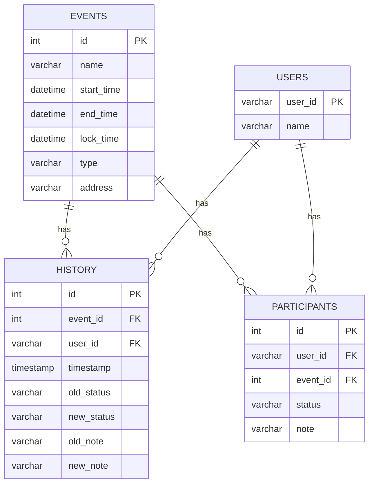

# Database Schema Documentation

## Entity Relationship Diagram

```mermaid
erDiagram
    EVENTS {
        int id PK
        varchar name
        datetime start_time
        datetime end_time
        datetime lock_time
        varchar type
        varchar address
    }
    PARTICIPANTS {
        int id PK
        varchar user_id FK
        int event_id FK
        varchar status
        varchar note
    }
    USERS {
        varchar user_id PK
        varchar name
    }
    HISTORY {
        int id PK
        int event_id FK
        varchar user_id FK
        timestamp timestamp
        varchar old_status
        varchar new_status
        varchar old_note
        varchar new_note
    }

    EVENTS ||--o{ HISTORY: "has"
    EVENTS ||--o{ PARTICIPANTS: "has"
    USERS ||--o{ HISTORY: "has"
    USERS ||--o{ PARTICIPANTS: "has"
```